# Dokumentasi Arsitektur, Fitur, dan Alur Kerja Sistem BHP

Dokumen ini berisi penjelasan komprehensif mengenai struktur database, hak akses (fitur) untuk masing-masing role pengguna, serta alur kerja (*workflow*) yang diterapkan pada **Sistem Informasi Bahan Habis Pakai (BHP) Laboratorium**.

---

## 📂 1. Arsitektur Database (10 Tabel Utama Aktif)

Untuk menjaga performa, akurasi, dan kualitas riwayat (*audit trail*), database sistem BHP ini telah dibersihkan dari tabel-tabel sisa iterasi lama yang tidak terpakai (`penggunaan_bahan` & `penggunaan_pengambil`). 

Kini sistem menggunakan **10 tabel utama** yang saling terintegrasi:

| No | Nama Tabel | Deskripsi & Fungsi Utama |
|:--:|:---|:---|
| **1** | `users` | Menyimpan kredensial akun beserta profil lengkap (NIM/NIP, kelas, angkatan, program studi, no. telepon) dan kolom peran pengguna (`role`: **admin**, **ketua_jurusan**, **mahasiswa**). |
| **2** | `satuan` | Master data satuan takaran/kemasan bahan laboratorium (contoh: *Pcs, Botol, Ml, Gram, Box*). |
| **3** | `bahan` | Master katalog bahan habis pakai yang mencantumkan nama, spesifikasi, lokasi rak penyimpanan, jumlah stok saat ini, serta *minimal stok* (sebagai batas peringatan kritis). |
| **4** | `bahan_masuk` | Pencatatan transaksi bahan baru yang dibeli/masuk lengkap dengan nomor faktur, harga satuan, pemasok, pembuat transaksi, serta status persetujuan Ketua Jurusan. |
| **5** | `modul_praktikum` | Template modul praktikum yang dibuat oleh Admin untuk memudahkan pengajuan bahan secara paket. |
| **6** | `modul_praktikum_items`| Tabel pivot yang menghubungkan modul praktikum dengan list bahan habis pakai serta kuantitas standar yang dibutuhkan modul tersebut. |
| **7** | `pengajuan` | Header transaksi ketika mahasiswa mengajukan peminjaman/permintaan BHP (menyimpan kode pengajuan, tipe pengajuan: *modul* atau *mandiri*, tanggal pakai, data kelompok, jumlah anggota, dan status). |
| **8** | `pengajuan_items` | Detail bahan yang diajukan mahasiswa. Tabel ini menggunakan teknik **Snapshot** (menyimpan `nama_bahan_snapshot` dan `satuan_snapshot`) agar riwayat laporan tidak berubah meskipun di kemudian hari data master bahan diubah/dihapus. |
| **9** | `stock_opname` | Log pencatatan penyesuaian stok manual apabila terjadi kasus bahan rusak, kadaluarsa, hilang, atau koreksi selisih audit fisik laboratorium dengan alasan wajib. |
| **10**| `log_stok` | **Jantung dari audit trail**. Setiap pergerakan stok bertambah (*masuk*), berkurang (*keluar*), maupun penyesuaian (*opname*) otomatis tercatat di tabel ini beserta riwayat stok sebelum dan sesudahnya. |

> [!NOTE]
> **Teknik Snapshot pada Pengajuan Items** digunakan agar data laporan transaksi di masa lalu tetap akurat. Jika nama bahan diubah di tabel `bahan` (misal: "H2SO4" diubah menjadi "Asam Sulfat"), data transaksi lama pada tabel `pengajuan_items` tetap memuat nama asli saat transaksi diajukan.

---

## 🔑 2. Fitur Berdasarkan Role Pengguna

Sistem ini menerapkan pembagian hak akses (*Role-Based Access Control*) yang ketat untuk menjaga keamanan data:

### 👨‍💼 Admin (Laboran/Pengelola Lab)
Admin memiliki kontrol penuh terhadap operasional harian laboratorium:
*   **Dashboard Utama**: Memantau ringkasan total bahan, pengajuan yang butuh review segera, daftar stok kritis (di bawah minimal stok), dan grafik tren penggunaan.
*   **Manajemen Akun (`Users`)**: Melakukan CRUD data mahasiswa, dosen/staf, atau ketua jurusan.
*   **Manajemen Katalog & Satuan (`Bahan` & `Satuan`)**: Mengelola data fisik bahan habis pakai, spesifikasi, lokasi loker, dan unit satuan.
*   **Modul Praktikum**: Membuat rancangan/paket kebutuhan bahan per modul agar mahasiswa tidak perlu memilih bahan satu per satu saat praktikum.
*   **Bahan Masuk**: Menginput restock bahan baru (menunggu approval Ketua Jurusan agar stok bertambah).
*   **Persetujuan Pengajuan**: Melakukan peninjauan (*Review*) permintaan bahan dari mahasiswa:
    *   *Approve*: Menyetujui permintaan.
    *   *Reject*: Menolak permintaan dengan menyertakan alasan penolakan tertulis.
    *   *Complete*: Menyelesaikan transaksi ketika bahan fisik diserahkan ke mahasiswa (stok terpotong otomatis di tahap ini).
*   **Stock Opname**: Melakukan penyesuaian stok jika terdapat selisih fisik (rusak, hilang, kadaluarsa).
*   **Laporan Pergerakan**: Melihat histori log stok keluar masuk secara detail.

### 🏛️ Ketua Jurusan (Kjur)
Ketua Jurusan berfokus pada pengawasan, persetujuan anggaran/bahan masuk, dan evaluasi:
*   **Dashboard Eksekutif**: Melihat tren penggunaan bahan dan status stok laboratorium.
*   **Stok Bahan**: Memantau ketersediaan bahan secara real-time tanpa bisa mengubah datanya (*read-only*).
*   **Persetujuan Bahan Masuk**: Memberikan izin/approval terhadap transaksi bahan masuk yang diinput Admin sebelum stoknya sah masuk ke gudang.
*   **Monitoring Transaksi**: Melihat semua riwayat transaksi pengajuan BHP mahasiswa beserta statusnya.
*   **Rekap Laporan**: Mengakses laporan komprehensif penggunaan BHP untuk kebutuhan analisis per semester/tahun.

### 🎓 Mahasiswa
Mahasiswa memiliki hak akses untuk meminta bahan demi menunjang kegiatan akademis:
*   **Katalog Bahan**: Melihat katalog bahan habis pakai yang tersedia di laboratorium beserta lokasinya.
*   **Pengajuan BHP Praktis**:
    *   *Pengajuan Modul*: Memilih modul praktikum yang telah dirancang Admin, sehingga list bahan & jumlah takaran default otomatis terisi secara instan.
    *   *Pengajuan Mandiri*: Memilih jenis bahan secara manual (berguna untuk penelitian mandiri atau Tugas Akhir).
    *   *Detail Kelompok*: Mengisi mata kuliah, kelas, nama kelompok, jumlah anggota, tanggal pemakaian, dan keterangan.
*   **Tracking Status**: Memantau real-time status pengajuan (*Pending*, *Approved*, *Rejected* lengkap dengan alasannya, atau *Completed*).

---

## 🔄 3. Alur Kerja Sistem (System Flow)

Sistem Informasi BHP ini bekerja melalui **3 Alur Utama**:

```mermaid
flowchart TD
    %% Style definitions
    classDef admin fill:#3b82f6,stroke:#1d4ed8,color:#fff
    classDef kjur fill:#10b981,stroke:#047857,color:#fff
    classDef mhs fill:#f59e0b,stroke:#d97706,color:#fff
    classDef system fill:#6b7280,stroke:#374151,color:#fff

    %% 1. Bahan Masuk
    subgraph Alur_Bahan_Masuk [1. Alur Bahan Masuk & Restock]
        A1[Admin Input Bahan Masuk]:::admin --> A2[Status: Pending Kjur]:::system
        A2 --> A3{Kjur Review?}:::kjur
        A3 -- Approve --> A4[Stok Bahan Bertambah & Log Stok Masuk]:::system
    end

    %% 2. Pengajuan
    subgraph Alur_Pengajuan_BHP [2. Alur Pengajuan & Distribusi BHP]
        M1[Mahasiswa Buat Pengajuan<br>Modul / Mandiri]:::mhs --> M2[Isi Form & Anggota Kelompok]:::mhs
        M2 --> M3[Status: Pending Review]:::system
        M3 --> O1{Admin Review?}:::admin
        
        O1 -- Reject --> O2[Status: Rejected<br>Isi Alasan Penolakan]:::system
        O2 --> M1
        
        O1 -- Approve --> O3[Status: Approved<br>Mahasiswa Ambil Fisik Barang]:::system
        O3 --> O4[Admin Klik Complete<br>Saat Serah Terima]:::admin
        O4 --> O5[Stok Bahan Terpotong & Log Stok Keluar]:::system
    end

    %% 3. Stock Opname
    subgraph Alur_Stock_Opname [3. Alur Stock Opname / Penyesuaian]
        S1[Admin Hitung Fisik Lab]:::admin --> S2[Temukan Selisih / Barang Rusak]:::admin
        S2 --> S3[Admin Input Stock Opname<br>Pilih Jenis & Alasan Wajib]:::admin
        S3 --> S4[Stok Terkoreksi Otomatis & Log Stok Opname]:::system
    end
```

### 1. Siklus Penyediaan & Restock Bahan
1. **Admin** mendaftarkan barang baru atau melakukan restock dengan menginput data ke menu **Bahan Masuk** (mencatat nomor faktur dan harga beli).
2. Status transaksi bahan masuk tersebut bernilai `Pending` persetujuan Ketua Jurusan.
3. **Ketua Jurusan** masuk ke akunnya, meninjau transaksi tersebut pada menu **Bahan Masuk**, lalu mengklik **Approve**.
4. Sistem secara otomatis memperbarui jumlah stok di master **Bahan** dan menulis riwayat penambahan ini di **Log Stok** sebagai kategori `masuk`.

### 2. Siklus Pengajuan & Distribusi Bahan
1. **Mahasiswa** membuat pengajuan pemakaian bahan secara berkelompok dengan mengisi tanggal pemakaian, kelas, serta memilih bahan (baik secara mandiri atau otomatis via *modul praktikum*).
2. Transaksi masuk ke antrean Admin dengan status awal `pending_review`.
3. **Admin** memeriksa permohonan tersebut:
    *   Jika ditolak (misal karena stok fisik tidak mencukupi), Admin mengklik **Reject** dan memberikan alasan. Mahasiswa dapat melihat alasan tersebut dan melakukan revisi pengajuan.
    *   Jika disetujui, Admin mengklik **Approve**. Status berubah menjadi `approved`.
4. Pada hari H pemakaian, **Mahasiswa** mengambil bahan fisik ke laboratorium.
5. Setelah bahan diserahkan dengan benar, **Admin** mengklik tombol **Complete** pada sistem. 
6. Di detik itu juga, sistem memotong jumlah stok bahan bersangkutan dan mencatat pengeluaran di **Log Stok** sebagai kategori `keluar`.

### 3. Siklus Pengawasan & Penyesuaian Fisik (Stock Opname)
1. **Admin** melakukan pengecekan fisik berkala di gudang laboratorium.
2. Jika ditemukan bahan yang pecah botolnya, kedaluwarsa, atau hilang, Admin menginput data penyesuaian di menu **Stock Opname**.
3. Admin wajib memilih tipe masalah (rusak, hilang, kadaluarsa, atau koreksi lain) serta wajib menuliskan alasan konkret penyesuaian.
4. Sistem mengoreksi jumlah stok di master bahan ke angka riil terbaru dan mencatat perubahannya ke **Log Stok** sebagai kategori `opname` / `adjust`.

---
> [!IMPORTANT]
> Seluruh proses pengajuan, persetujuan bahan masuk, dan stock opname di atas telah dilengkapi dengan **Fitur Pencarian (Search)** dan **Pagination** di data table untuk memudahkan navigasi saat data membesar.
